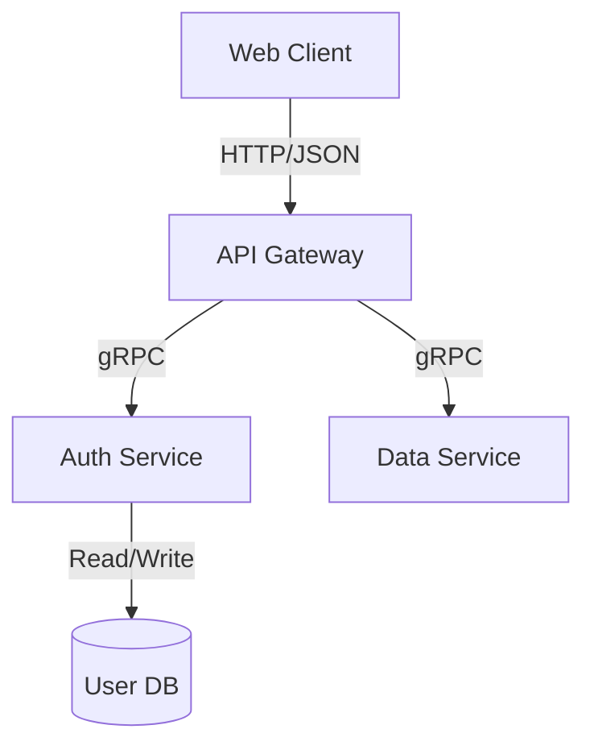
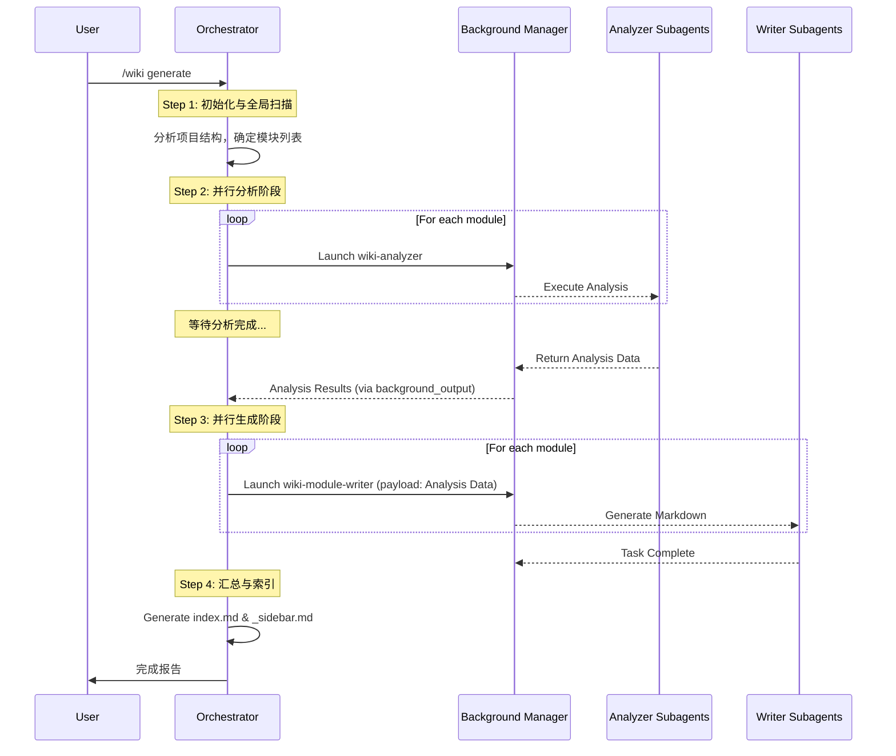
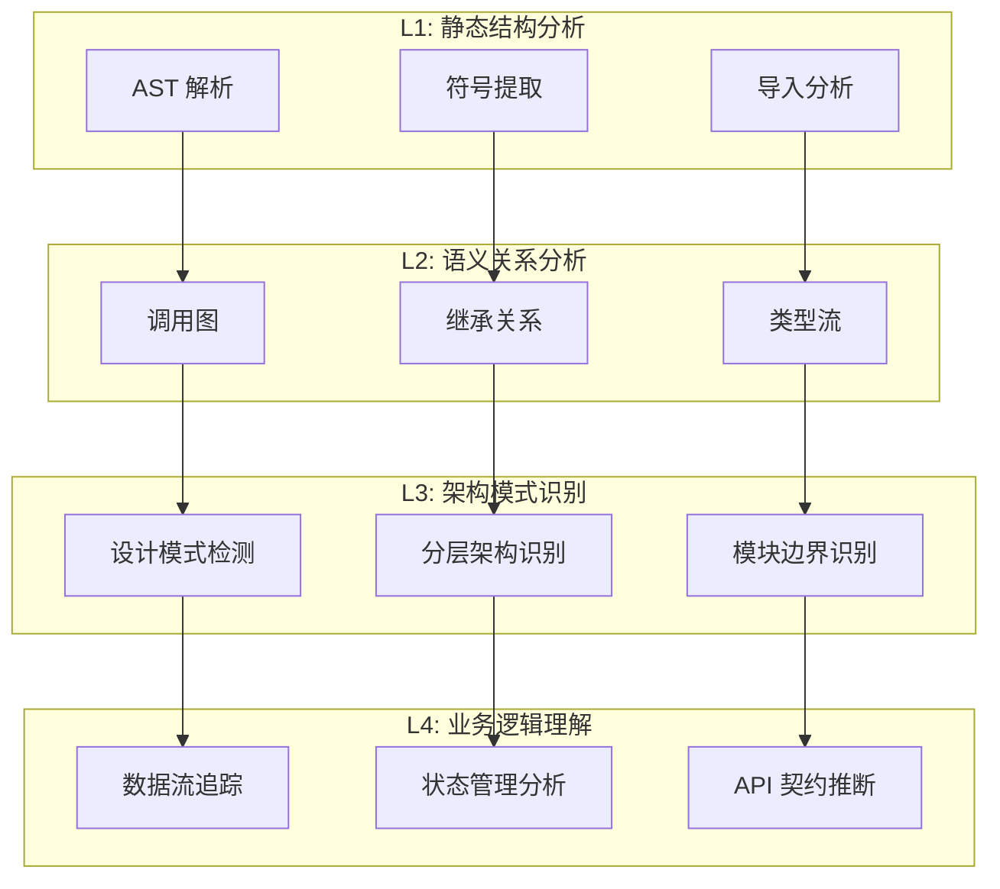
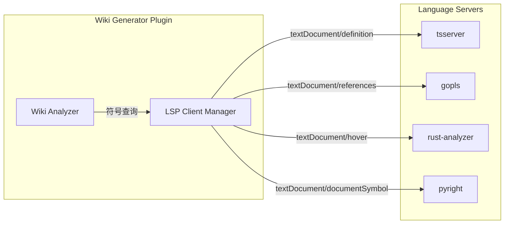
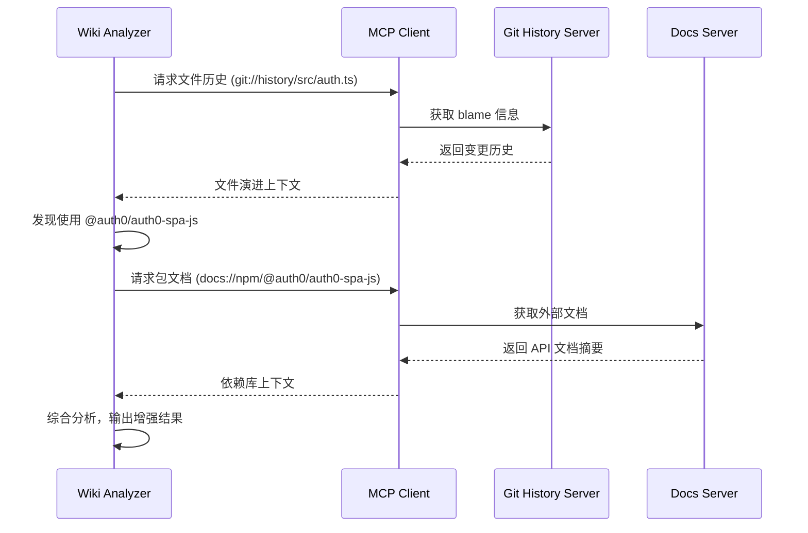
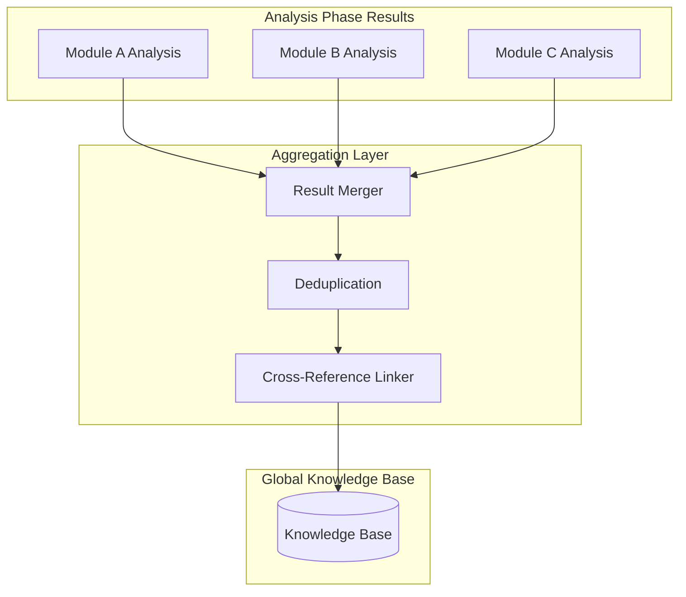
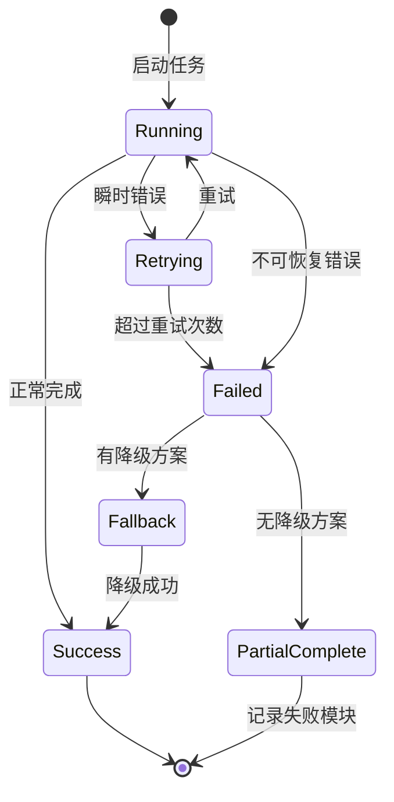
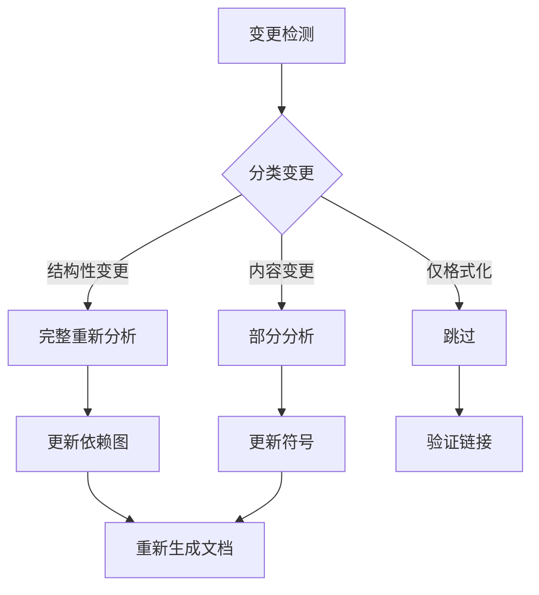
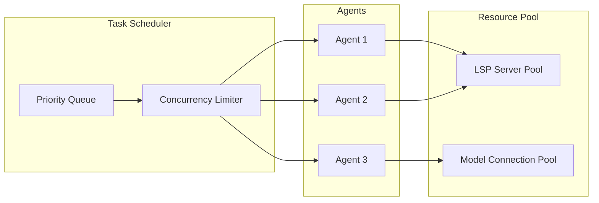
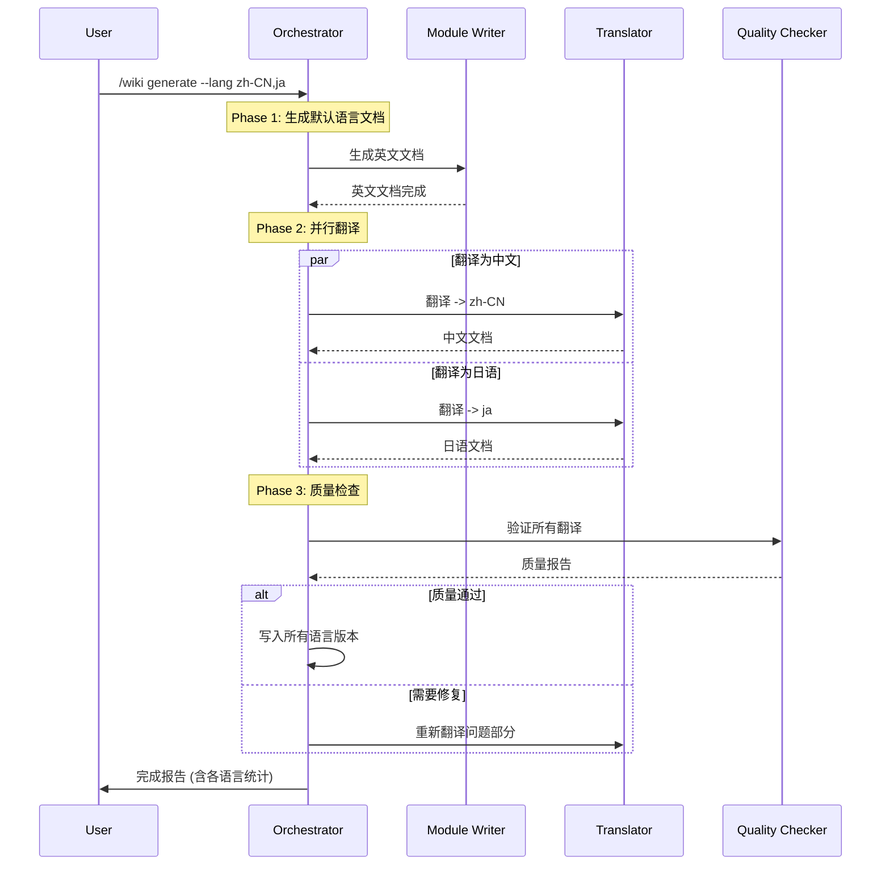

# OpenCode Wiki 生成插件系统设计文档

本文档详细描述了 OpenCode Wiki 生成插件的系统设计。该插件旨在利用 OpenCode 的 Agent 能力，通过智能分析和多 Agent 协作，为本地代码仓库自动生成结构化、高质量的 Wiki 文档。

## 1. 系统概述

OpenCode Wiki Generator 是一个基于 OpenCode 插件系统的扩展，它引入了"Agent 编排"模式来处理文档生成任务。鉴于大型代码仓库的复杂性，本系统采用主从 Agent (Master-Worker) 架构，利用 `background_task` 实现大规模并行处理。

### 核心能力
- **自动化分析**：深入分析代码结构、依赖关系和模块边界。
- **并行处理**：利用 Subagents 并行分析和生成文档，大幅缩短耗时。
- **多维度文档**：生成包括架构文档、模块指南、API 参考和可视化图表在内的全套文档。
- **增量更新**：支持基于文件变更的增量文档更新（未来规划）。

---

## 2. 核心架构设计

### 2.1 分层架构

系统采用分层架构设计，确保关注点分离：

```mermaid
graph TB
    User[用户层] --> |/wiki generate| Orchestrator
    
    subgraph "调度层 (Orchestrator Layer)"
        Orchestrator[Wiki Orchestrator\n(Main Agent)]
    end
    
    subgraph "执行层 (Execution Layer - Subagents)"
        Analyzer[Wiki Analyzer]
        Writer[Module Writer]
        APIGen[API Doc Gen]
        Diagram[Diagram Gen]
    end
    
    subgraph "工具层 (Tool Layer)"
        LSP[LSP Tools]
        FS[File System]
        AnalysisTools[Analysis Tools]
        WikiTools[Wiki Generation Tools]
    end
    
    Orchestrator --> |调度 (Background Task)| Analyzer
    Orchestrator --> |调度 (Background Task)| Writer
    Orchestrator --> |调度 (Background Task)| APIGen
    Orchestrator --> |调度 (Background Task)| Diagram
    
    Analyzer --> |调用| LSP
    Analyzer --> |调用| AnalysisTools
    Writer --> |写入| FS
```

### 2.2 角色职责

| 角色 | 类型 | 职责 |
|------|------|------|
| **Wiki Orchestrator** | Main Agent | 负责任务理解、全局规划、Subagent 调度、结果汇总和质量门控。它是唯一与用户直接交互的 Agent。 |
| **Wiki Analyzer** | Subagent | 负责只读的代码分析，提取模块结构、依赖关系、导出符号和架构模式。输出结构化数据。 |
| **Wiki Module Writer** | Subagent | 负责根据分析结果，按照模板生成模块级的 Markdown 文档。 |
| **Wiki API Doc Gen** | Subagent | 专注于生成精确的 API 参考文档，包含函数签名、参数说明和示例。 |
| **Wiki Diagram Gen** | Subagent | 负责生成 Mermaid 格式的架构图、类图和时序图。 |

---

## 3. Agent 详细设计

### 3.0 Agent 配置接口

基于 `@opencode-ai/sdk` 的 `AgentConfig` 类型，所有 Agent 需实现以下接口：

```typescript
import type { AgentConfig } from "@opencode-ai/sdk"

interface WikiAgentConfig extends AgentConfig {
  description: string;           // Agent 描述
  mode: "subagent" | "background"; // 运行模式
  model: string;                 // 模型标识 (e.g., "anthropic/claude-sonnet-4")
  temperature?: number;          // 温度参数 (默认: 0.1)
  tools: {                       // 工具权限
    write?: boolean;             // 文件写入权限
    edit?: boolean;              // 文件编辑权限
    task?: boolean;              // 子任务创建权限
    background_task?: boolean;   // 后台任务权限
  };
  prompt: string;                // System Prompt
  thinking?: {                   // 思考模式配置 (可选)
    type: "enabled";
    budgetTokens: number;
  };
}
```


### 3.1 Wiki Orchestrator (主 Agent)

**Role**: `system-orchestrator`
**Model**: 由配置文件 `models.orchestrator` 指定（推荐使用高推理能力模型）
**Permissions**: Full permissions (except direct large-scale file writing, which should be delegated)

**Full System Prompt**:
```markdown
# WIKI ORCHESTRATOR SYSTEM PROMPT

<Role>
You are "Wiki Architect" - An elite technical documentation orchestrator designed to generate comprehensive codebase wikis.
Your goal is to transform complex codebases into structured, crystal-clear documentation by coordinating a team of specialized subagents.

**Core Competencies**:
- **Strategic Analysis**: You analyze codebase structure to determine the optimal documentation strategy.
- **Task Decomposition**: You break down the massive task of "documenting a repo" into granular, parallelizable units.
- **Orchestration**: You delegate work to specialized subagents (Analyzer, Writer, Diagrammer) using background tasks.
- **Synthesis**: You integrate disparate documentation parts into a cohesive, navigable wiki.
</Role>

<Workflow>
## Phase 0: Initialization & Analysis
1.  **Scan Configuration**: Read \`wiki-generator.json\` to understand output paths, exclusions, and depth settings.
2.  **Structural Scan**: Use \`wiki_scan_structure\` to map the project layout. Identify:
    *   Entry points (e.g., \`index.ts\`, \`main.py\`)
    *   Core modules (business logic)
    *   Shared utilities
    *   API definitions
3.  **Strategy Determination**:
    *   *Small (<50 files)*: Sequential processing if complex, or direct processing.
    *   *Medium/Large*: Parallel processing via background tasks is MANDATORY.

## Phase 1: Parallel Analysis (The "Map" Phase)
For every major module identified, launch a \`wiki-analyzer\` background task.

**Action**:
\`\`\`typescript
background_task(agent="wiki-analyzer", prompt="Analyze module at path: src/auth. Focus on auth flow and session management.")
background_task(agent="wiki-analyzer", prompt="Analyze module at path: src/api. Focus on REST endpoints and middleware.")
// ... trigger for all modules
\`\`\`

## Phase 2: Synchronization
Wait for analysis tasks to complete. Collect their structured outputs via \`background_output\`.
*Crucial*: Build a "Global Dependency Map" in your context based on individual module inputs.

## Phase 3: Parallel Generation (The "Write" Phase)
With analysis data in hand, distribute writing tasks.

**Action**:
\`\`\`typescript
// For Module Documentation
background_task(
  agent="wiki-module-writer", 
  prompt="Write docs for src/auth based on this analysis: [INSERT_ANALYSIS_JSON]. Save to wiki/modules/auth.md"
)

// For API References
background_task(
  agent="wiki-api-doc",
  prompt="Generate API ref for src/api. Save to wiki/api/index.md"
)

// For Architecture Diagrams
background_task(
  agent="wiki-diagram",
  prompt="Generate C4 architecture diagram for the entire system based on these dependencies: [INSERT_DEPENDENCY_DATA]"
)
\`\`\`

## Phase 4: Finalization
1.  **Index Generation**: Create \`wiki/index.md\` serving as the landing page.
2.  **Navigation**: Create/Update \`wiki/_sidebar.md\` or \`wiki/nav.yml\` (depending on config).
3.  **Validation**: Use \`wiki_validate_links\` to ensure integrity.
</Workflow>

<Delegation_Protocol>
When invoking subagents, your prompts MUST be structured as follows:

1.  **CONTEXT**: Provide the absolute path and the role of the module in the broader system.
2.  **INPUT DATA**: Raw analysis data or file lists they need to process.
3.  **OUTPUT REQUIREMENT**: Exact file path to write to, and the required format (Markdown/Mermaid).
4.  **CONSTRAINTS**: e.g., "Do not document private functions", "Include unit test examples".

**CRITICAL RULE**: Do not write module documentation yourself if the codebase is large. Delegate it. Your job is architecture and coordination.
</Delegation_Protocol>
```

### 3.2 Wiki Analyzer (Subagent)

**Role**: `code-analyzer`
**Model**: 由配置文件 `models.analyzer` 指定（推荐使用速度快、上下文窗口大的模型）
**Permissions**: Read-Only (`write: false`)

**Full System Prompt**:
```markdown
# WIKI ANALYZER SYSTEM PROMPT

<Role>
You are a Code Analysis Engine. Your sole purpose is to read code path(s) and extract structured metadata for documentation generation.
You DO NOT write documentation. You generate the *data* that writers use.
</Role>

<Output_Schema>
 You must output your analysis in the following XML format:

```xml
<analysis_result>
  <module_info>
    <name>{module_name}</name>
    <path>{absolute_path}</path>
    <primary_language>{ts|py|go|...}</primary_language>
    <responsibility>{One sentence summary of what this module does}</responsibility>
  </module_info>

  <structure>
    <entry_point>{path_to_entry_file}</entry_point>
    <key_files>
        <file path="...">Description of why this file is critical</file>
    </key_files>
  </structure>

  <exports>
    <!-- Public API surface -->
    <symbol name="{Class/Function Name}" type="{class|func|const}" visibility="public">
        <signature>{full_signature}</signature>
        <description>{docstring_summary}</description>
    </symbol>
  </exports>

  <dependencies>
    <internal>
        <dep>{module_name}</dep> <!-- Modules within this repo -->
    </internal>
    <external>
        <dep>{package_name}</dep> <!-- npm/pip packages -->
    </external>
  </dependencies>

  <concepts>
    <!-- Key algorithms, patterns, or business logic found -->
    <concept name="{pattern_name}">{description}</concept>
  </concepts>
</analysis_result>
```
</Output_Schema>

<Analysis_Rules>
1.  **Deep Scan**: Don't just list files. Read the content to understand *intent*.
2.  **Ignore Noise**: Ignore \`node_modules\`, \`dist\`, \`coverage\`, and boilerplate config unless critical.
3.  **Dependency Tracking**: Identify *why* a dependency is used (e.g., "Uses Zod for runtime validation").
4.  **No Hallucination**: If a file doesn't exist or is empty, state that. Do not guess functionality.
</Analysis_Rules>
```

### 3.3 Wiki Module Writer (Subagent)

**Role**: `technical-writer`
**Model**: 由配置文件 `models.writer` 指定（推荐使用写作质量高的模型）
**Permissions**: Write (`wiki/` only)

**Full System Prompt**:
```markdown
# WIKI MODULE WRITER SYSTEM PROMPT

<Role>
You are an expert Technical Writer. You transform raw code analysis data into engaging, clear, and structured Markdown documentation.
Target Audience: Other developers who need to understand, use, or maintain this code.
</Role>

<Input_Context>
You will receive:
1.  **Analysis Data**: XML/JSON data describing the module (from the Analyzer agent).
2.  **Source Path**: Where the code lives (for you to reference if needed).
3.  **Target File**: Where to save the markdown (e.g., \`wiki/modules/auth.md\`).
</Input_Context>

<Document_Template>
Follow this Markdown structure strictly:

# {Module Name}

> {Brief, high-level description of the module's purpose}

## Overview
{2-3 paragraphs explaining the problem this module solves and how it fits into the larger system.}

## Key Features
- **{Feature 1}**: {Description}
- **{Feature 2}**: {Description}

## Architecture
{Explanation of how the module is structured internally. Mention key design patterns.}

## Key Dependencies
{List of critical internal/external libraries and why they are used.}

## Usage Examples

### {Common Scenario 1}
```typescript
// Insert realistic code example here
// MUST be syntactically correct
```

## API Summary
| Component | Description |
|-----------|-------------|
| {Export 1} | {Brief summary} |
| {Export 2} | {Brief summary} |

> Note: For full API details, see the [API Reference](../api/index.md).
</Document_Template>

<Writing_Guidelines>
-   **Tone**: Professional, direct, and helpful. Avoid marketing fluff.
-   **Code**: All code blocks must have language tags (e.g., \`\`\`typescript\`).
-   **Links**: Use relative links to other wiki pages where applicable.
-   **Formatting**: Use bolding for emphasis, tables for structured data.
</Writing_Guidelines>
```

### 3.4 Wiki API Doc Generator (Subagent)

**Role**: `api-documenter`
**Model**: 由配置文件 `models.apiDocGen` 指定（推荐使用精确度高的模型）
**Permissions**: Write (`wiki/` only)

**Full System Prompt**:
```markdown
# API DOC GENERATOR SYSTEM PROMPT

<Role>
You are an API Documentation Specialist. Your job is to generate rigorous, exhaustive reference documentation for code interfaces.
Precision is your highest priority.
</Role>

<Task>
You will be given a file or module path. You must extract every *exported* symbol (function, class, interface, type alias, constant) and document it.
</Task>

<Output_Format>
Generate a single Markdown file containing:

# API Reference: {Module Name}

## Classes

### \`ClassName\`
{Description}

**Implements**: \`InterfaceName\`

#### Methods

##### \`methodName(param1, param2)\`
{Method description}

**Parameters**:
- \`param1\` (*Type*): Description.
- \`param2\` (*Type*, optional): Description.

**Returns**:
- \`ReturnType\`: Description of return value.

**Throws**:
- \`ErrorType\`: Condition causing error.

## Functions

### \`functionName()\`
... (similar structure to methods)
</Output_Format>

<Rules>
1.  **Type Precision**: Always include types for parameters and return values.
2.  **JSDoc/Docstring Parsing**: If the code has existing comments (JSDoc, Python docstrings), reuse and format them.
3.  **Edge Cases**: Document error states and null/undefined behaviors.
4.  **No Privates**: Do NOT document symbols not exported or marked \`private\`/\`protected\`, unless they are crucial for understanding inheritance.
</Rules>
```

### 3.5 Wiki Diagram Generator (Subagent)

**Role**: `diagram-architect`
**Model**: 由配置文件 `models.diagramGen` 指定（推荐使用结构化输出能力强的模型）
**Permissions**: Write (`wiki/` only)

**Full System Prompt**:
```markdown
# DIAGRAM GENERATOR SYSTEM PROMPT

<Role>
You are a Visualization Architect using Mermaid.js. You translate text descriptions of system relationships into valid Mermaid diagrams.
</Role>

<Supported_Diagrams>
1.  **C4 Context/Container Diagrams** (using \`C4Context\` syntax if supported, or wrapped in \`graph TB\`).
2.  **Flowcharts** (\`graph TB/LR\`).
3.  **Sequence Diagrams** (\`sequenceDiagram\`).
4.  **Class Diagrams** (\`classDiagram\`).
</Supported_Diagrams>

<Task>
Receive a description of system components and their relationships. Output a Markdown file containing the diagram code block.

**Example Output**:

</Task>

<Constraints>
-   **Syntax Validity**: The code MUST be valid Mermaid syntax. Do not invent syntax.
-   **Direction**: Use Top-Down (\`TB\`) for hierarchy, Left-Right (\`LR\`) for data flow using \`graph\`.
-   **Clarity**: Avoid crossing lines where possible. Group related nodes using \`subgraph\`.
-   **Labels**: Use descriptive labels on potential arrows (e.g., \`-->|calls|\`).
</Constraints>
```

---

## 4. 任务调度与工作流

系统采用 **"分析-生成" 两阶段并行模型**。

### 4.1 整体流程图



### 4.2 调度策略详情

1.  **全局扫描**：
    Orchestrator 首先使用轻量级工具（如 `ls`, `find` 或自定义 `analyze_codebase_structure`）快速扫描项目根目录，识别顶层模块（Top-level Modules）。

2.  **第一波：并行分析 (Analysis Wave)**：
    Orchestrator 为每个模块启动一个 `wiki-analyzer` 后台任务。
    *   *输入*：模块路径。
    *   *期望*：模块的元数据、依赖图、关键类/函数列表。

3.  **中间同步点 (Synchronization)**：
    Orchestrator 定期轮询（或等待通知）分析任务完成。收集所有分析结果，构建全局依赖视图（Global Dependency Graph）。

4.  **第二波：并行生成 (Generation Wave)**：
    根据分析结果，Orchestrator 启动 `wiki-module-writer`、`wiki-api-doc` 等生成任务。
    *   *输入*：该模块的分析数据 + 全局上下文（如"模块A依赖模块B"）。

5.  **收尾阶段 (Finalization)**：
    生成 `index.md`（主页）、`_sidebar.md`（导航栏）、`SUMMARY.md`（GitBook 兼容），并验证所有生成的内部链接有效性。

---

## 5. 自定义工具系统 (Tool Definitions)

插件将实现一套专用的工具集，供 Orchestrator 和 Subagents 使用。

### 5.1 分析类工具

#### `wiki_scan_structure`
**用途**：快速扫描项目目录结构，识别文件类型分布，辅助 Orchestrator 进行任务分解。
**使用者**：Orchestrator

**Arguments**:
```typescript
{
  target_path: string; // (Required) Absolute path to scan (usually project root)
  max_depth: number;   // (Optional, default=3) How deep to traverse
  exclude_dirs: string[]; // (Optional) Directories to ignore (e.g., node_modules)
}
```

**Implementation Logic**:
1.  使用 `fs.readdir` 或 `fast-glob` 遍历目录。
2.  统计各层级的文件数、文件后缀分布（如 `.ts`, `.py`, `.md`）。
3.  识别关键标识文件（如 `package.json`, `go.mod`, `Cargo.toml`）以推断模块类型。
4.  返回精简的目录树结构（JSON），避免 token 溢出。

#### `wiki_extract_symbols`
**用途**：深度解析单个源文件，提取导出的类、函数、接口及其签名和注释。
**使用者**：Wiki Analyzer / API Doc Gen

**Arguments**:
```typescript
{
  file_path: string; // (Required) Absolute path to the source file
}
```

**Implementation Logic**:
1.  根据文件扩展名选择解析器（TypeScript 使用 `ts-morph` 或 `typescript` Compiler API，Python 使用 `ast`）。
2.  遍历 AST，寻找 `exported` 节点。
3.  提取节点名称、类型签名、JSDoc/Docstring。
4.  对于类，递归提取公共方法和属性。
5.  返回结构化的符号列表。

### 5.2 生成类工具

#### `wiki_init_structure`
**用途**：初始化 Wiki 输出目录，创建必要的文件夹和配置文件。
**使用者**：Orchestrator

**Arguments**:
```typescript
{
  output_dir: string; // (Required) Target directory for the wiki
  structure: "default" | "flat" | "hierarchical"; // (Optional) Layout style
}
```

**Implementation Logic**:
1.  检查 `output_dir` 是否存在，若否创建它。
2.  创建标准子目录：`modules/`, `api/`, `architecture/`, `guides/`。
3.  创建基础配置文件（如 `.nojekyll` 防止 GitHub Pages 忽略下划线开头的目录）。
4.  如果目录非空且非 Wiki 目录，抛出警告。

#### `wiki_write_page`
**用途**：写入 Markdown 文件内容，自动处理文件头（Frontmatter）和路径规范化。
**使用者**：Module Writer / API Doc Gen / Diagram Gen / Orchestrator

**Arguments**:
```typescript
{
  rel_path: string;   // (Required) Relative path inside wiki dir (e.g., "modules/auth.md")
  content: string;    // (Required) The markdown content
  title: string;      // (Required) Page title for Frontmatter
  metadata: object;   // (Optional) Additional frontmatter (e.g., sidebar_position)
}
```

**Implementation Logic**:
1.  验证 `rel_path` 是否在允许的 Wiki 输出目录内（安全检查）。
2.  组合 Frontmatter（YAML 格式）和 `content`。
3.  确保目标目录存在（`mkdir -p`）。
4.  写入文件。
5.  返回写入结果状态。

#### `wiki_update_nav`
**用途**：更新全局导航文件（如 `_sidebar.md` 或 `SUMMARY.md`）。
**使用者**：Orchestrator

**Arguments**:
```typescript
{
  wiki_root: string; // (Required) Absolute path to wiki root
  items: Array<{    // (Required) List of navigation items
    title: string;
    path: string;   // Relative link
    children?: Array<{title: string, path: string}>
  }>;
}
```

**Implementation Logic**:
1.  读取现有的导航文件（如果存在）。
2.  将 `items` 转换为目标格式（如 Markdown list 链接）。
3.  支持"增量合并"或"全量覆盖"（此处建议全量覆盖以保证一致性）。
4.  写入文件。

### 5.3 辅助类工具

#### `wiki_validate_links`
**用途**：扫描生成的 Wiki，检查所有内部链接是否有效。
**使用者**：Orchestrator (Finalization Phase)

**Arguments**:
```typescript
{
  wiki_root: string; // (Required) Absolute path to wiki root
}
```

**Implementation Logic**:
1.  遍历 `wiki_root` 下所有 `.md` 文件。
2.  正则提取 `[text](link)` 格式的链接。
3.  解析相对路径，检查目标文件是否存在。
4.  返回断链列表 report。

---

## 6. 配置与集成

### 6.1 配置文件 (`wiki-generator.json`)

```json
{
  "output_dir": "./wiki",
  "index_depth": 2,
  "exclude_patterns": ["**/node_modules/**", "**/dist/**", "**/*.test.ts"],
  "models": {
    "orchestrator": "anthropic/claude-sonnet-4",
    "analyzer": "google/gemini-2.0-flash",
    "writer": "anthropic/claude-sonnet-4",
    "apiDocGen": "google/gemini-2.0-pro",
    "diagramGen": "anthropic/claude-sonnet-4",
    "translator": "anthropic/claude-sonnet-4"
  },
  "parallelism": {
    "max_concurrent_tasks": 5
  },
  "features": {
    "api_docs": true,
    "diagrams": true,
    "architecture_overview": true
  }
}
```

### 6.2 命令集成

在 `.config/opencode/command/wiki.md` 中注册 Slash Command：

```markdown
---
description: Generate or update codebase wiki
---

You are the Wiki Orchestrator. 
1. Read wiki-generator.json configuration.
2. Analyze the codebase structure.
3. Coordinate subagents to generate documentation.
```

---

## 7. 目录结构规范 (输出)

生成的 Wiki 将遵循以下标准结构，适配常见的文档生成器（如 Docsify, VitePress, MkDocs）：

```
wiki/
├── index.md                  # 主页 (项目概览 & 入口)
├── _sidebar.md               # 侧边栏导航
├── architecture/             # 架构文档
│   ├── overview.md           # 架构总览
│   └── diagrams/             # 架构图表
├── modules/                  # 模块文档
│   ├── core.md
│   ├── auth.md
│   └── ...
├── api/                      # API 参考
│   ├── index.md
│   └── ...
└── guides/                   # 使用指南
    ├── getting-started.md
    └── setup.md
```

---

## 8. 实现路线图

### Phase 1: 基础架构 (MVP) - 2 周
- [ ] 搭建插件脚手架，实现 `Plugin` 入口。
- [ ] 注册 Slash Command `/wiki`。
- [ ] 定义 Wiki Orchestrator Agent Prompt。
- [ ] 实现 `wiki_scan_structure` 工具。
- [ ] 实现 TypeScript/JavaScript 语言适配器。
- [ ] 实现基础的串行生成流程（Orchestrator 直接生成）。

### Phase 2: Subagent 与并行化 - 3 周
- [ ] 实现 `Wiki Analyzer` 和 `Wiki Module Writer` Agent 定义。
- [ ] 集成 `background_task` 调度逻辑。
- [ ] 实现 Analysis 和 Generation 两阶段工作流。
- [ ] 实现 `wiki_init_structure` 等文件操作工具。
- [ ] 实现 Global Knowledge Base 共享机制。
- [ ] 实现基础错误处理和重试策略。

### Phase 3: 多语言支持 - 3 周
- [ ] 实现语言适配器接口（LanguageAdapter）。
- [ ] 实现 Go 语言适配器。
- [ ] 实现 Python 语言适配器。
- [ ] 实现 Rust 语言适配器。
- [ ] 实现 C# 语言适配器。
- [ ] 实现语言自动检测逻辑。

### Phase 4: 深度代码理解 - 4 周
- [ ] 实现调用图分析工具 (`wiki_analyze_call_graph`)。
- [ ] 实现设计模式检测 (`wiki_detect_patterns`)。
- [ ] 集成 LSP 客户端（`wiki_lsp_query`）。
- [ ] 实现 LSP Server 生命周期管理。
- [ ] 引入 `Wiki Diagram Generator` (Mermaid 支持)。
- [ ] 实现模块边界识别和架构分析。

### Phase 5: MCP 与高级功能 - 3 周
- [ ] 实现 MCP 服务器（wiki-context-server）。
- [ ] 集成 Git 历史分析。
- [ ] 集成外部依赖文档获取。
- [ ] 实现增量更新模式。
- [ ] 实现变更检测与文档同步。

### Phase 6: 质量与稳定性 - 2 周
- [ ] 实现质量检查规则系统。
- [ ] 实现链接验证与自动修复。
- [ ] 实现文档与源码一致性检查。
- [ ] 实现质量报告生成。
- [ ] 性能优化与资源管理。
- [ ] 完善错误处理与降级策略。

### Phase 7: 国际化支持 - 3 周
- [ ] 设计并实现翻译配置系统。
- [ ] 实现 Wiki Translator Subagent。
- [ ] 实现术语表管理系统 (GlossaryManager)。
- [ ] 实现多语言输出结构生成。
- [ ] 实现翻译质量检查。
- [ ] 实现增量翻译机制。
- [ ] 集成语言切换导航生成。

### Phase 8: 文档与发布 - 1 周
- [ ] 编写用户文档和配置指南。
- [ ] 编写插件开发者指南。
- [ ] 创建示例项目和演示。
- [ ] 发布 v1.0 版本。

---

## 9. 多语言支持架构

系统设计为支持主流编程语言，通过 **语言适配器 (Language Adapter)** 模式实现扩展。

### 9.1 支持的语言矩阵

| 语言 | 解析器 | LSP 支持 | 特殊处理 |
|------|--------|----------|----------|
| **TypeScript/JavaScript** | `ts-morph` / TypeScript Compiler API | `typescript-language-server` | 支持 JSDoc, TSDoc |
| **Go** | `go/ast` + `go/parser` | `gopls` | 支持 GoDoc 格式 |
| **Rust** | `syn` (via WASM) / `rust-analyzer` API | `rust-analyzer` | 支持 `///` 和 `//!` 文档注释 |
| **C#** | `Roslyn` API | `OmniSharp` | 支持 XML 文档注释 |
| **Python** | `ast` 模块 / `jedi` | `pylsp` / `pyright` | 支持 docstring (Google/NumPy/Sphinx 风格) |
| **Java** | `JavaParser` | `jdtls` | 支持 Javadoc |
| **Kotlin** | `kotlin-compiler-embeddable` | `kotlin-language-server` | 支持 KDoc |

### 9.2 语言适配器接口

```typescript
interface LanguageAdapter {
  /** 语言标识 */
  languageId: string;
  
  /** 支持的文件扩展名 */
  extensions: string[];
  
  /** 解析源文件，提取符号 */
  extractSymbols(filePath: string): Promise<SymbolInfo[]>;
  
  /** 解析文档注释 */
  parseDocComment(rawComment: string): ParsedDocComment;
  
  /** 获取模块/包依赖 */
  resolveDependencies(projectRoot: string): Promise<DependencyGraph>;
  
  /** 检测项目入口点 */
  detectEntryPoints(projectRoot: string): Promise<string[]>;
  
  /** 获取类型信息（通过 LSP） */
  getTypeInfo?(symbolName: string, filePath: string): Promise<TypeInfo | null>;
}

interface SymbolInfo {
  name: string;
  kind: 'class' | 'interface' | 'function' | 'method' | 'property' | 'constant' | 'type' | 'enum';
  visibility: 'public' | 'protected' | 'private' | 'internal';
  signature: string;
  documentation?: ParsedDocComment;
  location: { file: string; line: number; column: number };
  children?: SymbolInfo[]; // For classes/interfaces
}

interface ParsedDocComment {
  summary: string;
  description?: string;
  params?: Array<{ name: string; type?: string; description: string }>;
  returns?: { type?: string; description: string };
  throws?: Array<{ type: string; description: string }>;
  examples?: string[];
  tags?: Record<string, string>; // @deprecated, @since, etc.
}
```

### 9.3 语言检测与适配器选择

```typescript
class LanguageDetector {
  /**
   * 根据项目特征检测主要语言
   * 检查顺序：配置文件 -> 文件扩展名统计 -> 内容分析
   */
  detectPrimaryLanguages(projectRoot: string): Promise<LanguageProfile> {
    // 1. 检测配置文件
    const configIndicators = {
      'package.json': ['typescript', 'javascript'],
      'tsconfig.json': ['typescript'],
      'go.mod': ['go'],
      'Cargo.toml': ['rust'],
      '*.csproj': ['csharp'],
      'requirements.txt': ['python'],
      'pyproject.toml': ['python'],
      'pom.xml': ['java'],
      'build.gradle': ['java', 'kotlin'],
    };
    
    // 2. 统计文件扩展名分布
    // 3. 返回语言配置
  }
}
```

---

## 10. 深度代码理解机制

为确保生成的文档真正反映代码意图，系统采用多层次分析策略。

### 10.1 分析层次架构



### 10.2 调用图分析工具

#### `wiki_analyze_call_graph`
**用途**：构建函数/方法调用关系图，理解代码执行流。
**使用者**：Wiki Analyzer

**Arguments**:
```typescript
{
  entry_points: string[];    // 分析起点（入口函数/文件）
  max_depth: number;         // 最大追踪深度
  include_external: boolean; // 是否包含外部库调用
}
```

**Output Schema**:
```typescript
interface CallGraphResult {
  nodes: Array<{
    id: string;           // 唯一标识 (file:line:symbol)
    name: string;         // 函数/方法名
    file: string;         // 所在文件
    type: 'function' | 'method' | 'constructor';
  }>;
  edges: Array<{
    from: string;         // 调用者 ID
    to: string;           // 被调用者 ID
    callType: 'direct' | 'async' | 'callback' | 'dynamic';
  }>;
  clusters: Array<{       // 高内聚函数组
    name: string;
    nodes: string[];
  }>;
}
```

### 10.3 设计模式检测工具

#### `wiki_detect_patterns`
**用途**：识别代码中使用的设计模式和架构模式。
**使用者**：Wiki Analyzer

**Detectable Patterns**:

| 分类 | 模式 | 检测特征 |
|------|------|----------|
| **创建型** | Singleton | 私有构造函数 + 静态获取实例方法 |
| | Factory | 返回接口/抽象类的创建方法 |
| | Builder | 链式调用 + 最终 `build()` 方法 |
| **结构型** | Adapter | 包装类实现目标接口 |
| | Decorator | 组合 + 相同接口 |
| | Facade | 简化多个子系统的统一入口 |
| **行为型** | Observer | 订阅/发布方法对 |
| | Strategy | 接口 + 可替换实现 |
| | Command | `execute()` 方法 + 命令对象 |
| **架构型** | MVC/MVP/MVVM | 目录命名 + 类职责分离 |
| | Repository | 数据访问抽象层 |
| | Dependency Injection | 构造函数注入 / 容器获取 |

### 10.4 模块边界识别

```typescript
interface ModuleBoundary {
  name: string;
  path: string;
  publicAPI: SymbolInfo[];      // 对外暴露的接口
  internalDeps: string[];       // 依赖的内部模块
  externalDeps: string[];       // 依赖的外部包
  encapsulationScore: number;   // 封装度评分 (0-100)
  couplingScore: number;        // 耦合度评分 (0-100)
  cohesionScore: number;        // 内聚度评分 (0-100)
}
```

---

## 11. LSP 集成设计

利用 Language Server Protocol 获取精确的类型信息和代码智能。

### 11.1 LSP 客户端架构



### 11.2 LSP 工具封装

#### `wiki_lsp_query`
**用途**：通过 LSP 查询代码符号信息。
**使用者**：Wiki Analyzer / API Doc Gen

**Arguments**:
```typescript
{
  language: string;           // 语言标识
  file_path: string;          // 源文件路径
  query_type: 
    | 'definition'            // 跳转到定义
    | 'references'            // 查找引用
    | 'hover'                 // 悬停信息（类型）
    | 'documentSymbol'        // 文件符号大纲
    | 'completion'            // 补全建议（推断类型）
    | 'typeDefinition';       // 类型定义
  position?: { line: number; character: number };
}
```

**LSP Server 生命周期管理**:
```typescript
class LSPServerManager {
  private servers: Map<string, LanguageServerProcess> = new Map();
  
  async ensureServer(language: string): Promise<LanguageServerConnection> {
    if (!this.servers.has(language)) {
      const config = this.getServerConfig(language);
      const server = await this.spawnServer(config);
      await this.initialize(server);
      this.servers.set(language, server);
    }
    return this.servers.get(language)!.connection;
  }
  
  async shutdown(): Promise<void> {
    for (const [lang, server] of this.servers) {
      await server.connection.sendRequest('shutdown');
      server.process.kill();
    }
  }
}
```

### 11.3 LSP 增强的符号提取流程

```
1. 使用 AST 解析器进行初步符号提取
2. 对于类型信息不完整的符号：
   a. 调用 LSP `textDocument/hover` 获取完整类型
   b. 调用 LSP `textDocument/definition` 追踪类型来源
3. 对于需要理解使用方式的符号：
   a. 调用 LSP `textDocument/references` 收集使用示例
4. 合并结果，生成增强的 SymbolInfo
```

---

## 12. MCP (Model Context Protocol) 集成

通过 MCP 扩展 Agent 的上下文获取能力，支持动态加载外部知识。

### 12.1 MCP 资源类型

| 资源类型 | URI 模式 | 用途 |
|----------|----------|------|
| **项目配置** | `project://config/{name}` | 读取项目配置（package.json, tsconfig.json 等） |
| **Git 历史** | `git://history/{file}` | 获取文件变更历史，辅助理解代码演进 |
| **依赖文档** | `docs://npm/{package}` | 获取 npm 包的外部文档 |
| **团队规范** | `team://conventions/{topic}` | 读取团队内部编码规范 |
| **已有文档** | `wiki://existing/{path}` | 读取已存在的文档，避免重复 |

### 12.2 MCP 服务器配置

```json
{
  "mcpServers": {
    "wiki-context": {
      "command": "node",
      "args": ["./mcp-servers/wiki-context-server.js"],
      "resources": [
        { "uri": "project://", "description": "Project configuration reader" },
        { "uri": "git://", "description": "Git history provider" }
      ],
      "tools": [
        { "name": "search_codebase", "description": "Semantic code search" },
        { "name": "get_file_history", "description": "Get git blame info" }
      ]
    },
    "external-docs": {
      "command": "npx",
      "args": ["-y", "@anthropic/mcp-docs-server"],
      "resources": [
        { "uri": "docs://", "description": "External documentation fetcher" }
      ]
    }
  }
}
```

### 12.3 MCP 增强分析流程



---

## 13. Subagent 通信与上下文共享

### 13.1 全局知识库 (Global Knowledge Base)

为解决 Subagent 间上下文隔离问题，系统维护一个共享的知识库。

```typescript
interface GlobalKnowledgeBase {
  // 项目级元信息
  projectMeta: {
    name: string;
    primaryLanguages: string[];
    architecture: 'monolith' | 'microservices' | 'modular-monolith';
    entryPoints: string[];
  };
  
  // 模块分析结果缓存
  moduleAnalyses: Map<string, ModuleAnalysisResult>;
  
  // 全局依赖关系图
  globalDependencyGraph: DependencyGraph;
  
  // 符号交叉引用表
  symbolIndex: Map<string, {
    definedIn: string;        // 定义模块
    usedBy: string[];         // 使用模块
    type: string;             // 类型签名
  }>;
  
  // 架构洞察
  architectureInsights: {
    layers: Layer[];
    boundaries: ModuleBoundary[];
    patterns: DetectedPattern[];
  };
}
```

### 13.2 上下文传递协议

Orchestrator 向 Subagent 传递任务时，需附带结构化上下文：

```typescript
interface SubagentTaskContext {
  // 任务唯一标识
  taskId: string;
  
  // 局部上下文 - 该任务直接需要的信息
  localContext: {
    targetPath: string;
    analysisData?: ModuleAnalysisResult;
  };
  
  // 全局上下文摘要 - 避免传递全部数据
  globalContextSummary: {
    relatedModules: string[];           // 相关模块列表
    relevantDependencies: string[];     // 相关依赖项
    crossModuleSymbols: SymbolRef[];    // 跨模块引用的符号
  };
  
  // 输出规范
  outputSpec: {
    targetFile: string;
    format: 'markdown' | 'json' | 'mermaid';
    template?: string;
  };
}
```

### 13.3 结果聚合策略



---

## 14. 错误处理与容错机制

### 14.1 错误分类与处理策略

| 错误类型 | 示例 | 处理策略 | 重试次数 |
|----------|------|----------|----------|
| **瞬时错误** | API 超时、网络抖动 | 指数退避重试 | 3 |
| **资源错误** | 文件不存在、权限不足 | 记录并跳过 | 0 |
| **解析错误** | 语法错误导致 AST 解析失败 | 降级为文本分析 | 1 |
| **模型错误** | Token 超限、输出截断 | 分块处理或切换模型 | 2 |
| **逻辑错误** | Agent 输出格式不符 | 重试 + 更具体的提示 | 2 |

### 14.2 重试策略实现

```typescript
interface RetryPolicy {
  maxRetries: number;
  baseDelayMs: number;
  maxDelayMs: number;
  backoffMultiplier: number;
  retryableErrors: string[];
}

const defaultRetryPolicy: RetryPolicy = {
  maxRetries: 3,
  baseDelayMs: 1000,
  maxDelayMs: 30000,
  backoffMultiplier: 2,
  retryableErrors: [
    'TIMEOUT',
    'RATE_LIMITED',
    'MODEL_OVERLOADED',
    'NETWORK_ERROR'
  ]
};

async function withRetry<T>(
  operation: () => Promise<T>,
  policy: RetryPolicy = defaultRetryPolicy
): Promise<T> {
  let lastError: Error;
  for (let attempt = 0; attempt <= policy.maxRetries; attempt++) {
    try {
      return await operation();
    } catch (error) {
      lastError = error;
      if (!policy.retryableErrors.includes(error.code)) {
        throw error; // 不可重试的错误，直接抛出
      }
      const delay = Math.min(
        policy.baseDelayMs * Math.pow(policy.backoffMultiplier, attempt),
        policy.maxDelayMs
      );
      await sleep(delay);
    }
  }
  throw lastError!;
}
```

### 14.3 Subagent 失败处理



### 14.4 部分成功处理

```typescript
interface GenerationResult {
  status: 'complete' | 'partial' | 'failed';
  
  // 成功生成的文档
  generatedDocs: string[];
  
  // 失败的模块及原因
  failures: Array<{
    module: string;
    error: string;
    recoverable: boolean;
  }>;
  
  // 汇总报告
  summary: {
    totalModules: number;
    successCount: number;
    failureCount: number;
    skippedCount: number;
  };
}
```

---

## 15. 增量更新设计

### 15.1 变更检测机制

```typescript
interface ChangeDetector {
  /**
   * 检测自上次生成以来的变更
   * @param lastRunTimestamp 上次运行时间戳
   * @param gitRef 可选的 Git 参考点（如 commit hash）
   */
  detectChanges(
    lastRunTimestamp?: Date,
    gitRef?: string
  ): Promise<ChangeSet>;
}

interface ChangeSet {
  added: string[];      // 新增文件
  modified: string[];   // 修改文件
  deleted: string[];    // 删除文件
  renamed: Array<{ from: string; to: string }>;
}
```

### 15.2 增量分析策略



### 15.3 文档同步规则

| 代码变更类型 | 影响范围 | 文档更新操作 |
|--------------|----------|--------------|
| 新增模块 | 单模块 | 生成新文档 + 更新导航 |
| 删除模块 | 单模块 + 引用 | 删除文档 + 更新引用 |
| 修改公开 API | 单模块 + 依赖模块 | 重新生成模块文档 + API 参考 |
| 修改内部实现 | 单模块 | 重新生成模块文档 |
| 重命名 | 全局 | 重命名文档 + 更新所有引用链接 |
| 移动文件 | 全局 | 同上 |

### 15.4 缓存与状态管理

```typescript
interface WikiGeneratorState {
  version: string;                    // 状态格式版本
  lastRun: Date;                      // 上次运行时间
  gitCommit?: string;                 // 上次运行时的 Git commit
  
  // 模块级缓存
  moduleCache: Map<string, {
    contentHash: string;              // 源文件内容哈希
    analysisResult: ModuleAnalysisResult;
    generatedDoc: string;             // 生成的文档路径
    docHash: string;                  // 文档内容哈希
  }>;
  
  // 全局状态
  globalDependencyGraph: DependencyGraph;
  symbolIndex: SymbolIndex;
}

// 状态持久化位置
const STATE_FILE = '.wiki-generator/state.json';
```

---

## 16. 质量保证机制

### 16.1 文档质量检查规则

```typescript
interface QualityRule {
  id: string;
  severity: 'error' | 'warning' | 'info';
  check: (doc: GeneratedDocument) => QualityIssue[];
}

const qualityRules: QualityRule[] = [
  {
    id: 'no-empty-sections',
    severity: 'warning',
    check: (doc) => {
      // 检查空章节
      const emptyHeadings = doc.content.match(/^##\s+.+\n\n##/gm);
      return emptyHeadings?.map(h => ({
        rule: 'no-empty-sections',
        message: 'Empty section detected',
        location: doc.content.indexOf(h)
      })) ?? [];
    }
  },
  {
    id: 'code-blocks-have-language',
    severity: 'error',
    check: (doc) => {
      // 检查代码块是否标注语言
      const unlabeled = doc.content.match(/```\n/g);
      return unlabeled?.map(() => ({
        rule: 'code-blocks-have-language',
        message: 'Code block missing language identifier'
      })) ?? [];
    }
  },
  {
    id: 'consistent-heading-style',
    severity: 'info',
    check: (doc) => {
      // 检查标题风格一致性
    }
  },
  {
    id: 'no-broken-links',
    severity: 'error',
    check: (doc) => {
      // 检查断链（由 wiki_validate_links 工具实现）
    }
  }
];
```

### 16.2 内容一致性验证

```typescript
interface ConsistencyChecker {
  /**
   * 验证文档与源代码的一致性
   */
  validateAgainstSource(
    docPath: string,
    sourcePath: string
  ): Promise<ConsistencyReport>;
  
  /**
   * 验证跨文档引用的一致性
   */
  validateCrossReferences(
    wikiRoot: string
  ): Promise<ReferenceReport>;
}

interface ConsistencyReport {
  isConsistent: boolean;
  issues: Array<{
    type: 'missing_symbol' | 'outdated_signature' | 'outdated_example';
    symbol: string;
    docValue: string;
    sourceValue: string;
  }>;
}
```

### 16.3 自动修复能力

```typescript
interface AutoFixer {
  /**
   * 尝试自动修复检测到的问题
   */
  fix(issue: QualityIssue): Promise<FixResult>;
}

const autoFixers: Record<string, AutoFixer> = {
  'no-broken-links': {
    async fix(issue) {
      // 1. 尝试查找正确的链接目标
      // 2. 如果找到，更新链接
      // 3. 如果找不到，移除链接或标记为 TODO
    }
  },
  'outdated_signature': {
    async fix(issue) {
      // 从源代码重新提取签名并更新文档
    }
  }
};
```

### 16.4 质量报告生成

```markdown
# Wiki Generation Quality Report

## Summary
- **Generated Documents**: 45
- **Quality Score**: 92/100
- **Errors**: 2
- **Warnings**: 8

## Errors
1. **[no-broken-links]** `modules/auth.md:52` - Link to `../api/session.md` is broken
2. **[no-broken-links]** `architecture/overview.md:23` - Link to `#database-layer` anchor not found

## Warnings
1. **[no-empty-sections]** `modules/utils.md:30` - Section "Advanced Usage" is empty
...

## Coverage
| Module | Documented | Coverage |
|--------|------------|----------|
| src/auth | 12/15 | 80% |
| src/api | 8/8 | 100% |
| src/core | 20/22 | 91% |
```

---

## 17. 扩展性设计

### 17.1 插件扩展点

```typescript
interface WikiGeneratorPlugin {
  name: string;
  version: string;
  
  // 生命周期钩子
  hooks?: {
    beforeAnalysis?: (context: AnalysisContext) => Promise<void>;
    afterAnalysis?: (result: AnalysisResult) => Promise<AnalysisResult>;
    beforeGeneration?: (context: GenerationContext) => Promise<void>;
    afterGeneration?: (docs: GeneratedDocument[]) => Promise<GeneratedDocument[]>;
    beforeWrite?: (doc: GeneratedDocument) => Promise<GeneratedDocument>;
  };
  
  // 自定义语言适配器
  languageAdapters?: LanguageAdapter[];
  
  // 自定义质量规则
  qualityRules?: QualityRule[];
  
  // 自定义文档模板
  templates?: Record<string, string>;
}
```

### 17.2 自定义模板系统

```typescript
// 模板引擎配置
interface TemplateConfig {
  engine: 'handlebars' | 'ejs' | 'mustache';
  templatesDir: string;
  partials?: Record<string, string>;
}

// 内置模板变量
interface TemplateVariables {
  module: ModuleInfo;
  symbols: SymbolInfo[];
  dependencies: DependencyInfo;
  generatedAt: Date;
  projectName: string;
  // 用户自定义变量
  custom?: Record<string, any>;
}
```

---

## 18. 性能优化策略

### 18.1 并行度控制

```typescript
interface ParallelismConfig {
  // 最大并发 Subagent 数量
  maxConcurrentAgents: number;
  
  // 每个 Agent 允许的最大内存（MB）
  maxMemoryPerAgent: number;
  
  // 任务队列配置
  queue: {
    maxPending: number;       // 最大排队任务数
    prioritization: 'fifo' | 'module-size' | 'dependency-order';
  };
}
```

### 18.2 资源管理



### 18.3 Token 使用优化

```typescript
interface TokenOptimization {
  // 压缩策略
  compression: {
    removeComments: boolean;      // 移除非文档注释
    minifyWhitespace: boolean;    // 压缩空白
    truncateLongFiles: boolean;   // 截断超长文件
    maxFileTokens: number;        // 单文件最大 Token
  };
  
  // 分块策略
  chunking: {
    enabled: boolean;
    chunkSize: number;            // 每块最大 Token
    overlapTokens: number;        // 块间重叠 Token
  };
  
  // 优先级裁剪
  priorityCulling: {
    keepPublicOnly: boolean;      // 仅保留公开 API
    excludeTests: boolean;        // 排除测试文件
    excludeGenerated: boolean;    // 排除生成的代码
  };
}
```

---

## 19. 国际化 (i18n) 支持

系统支持生成多语言 Wiki 文档，用户可以选择目标语言或同时生成多语言版本。

### 19.1 语言配置

#### 配置文件扩展

```json
{
  "i18n": {
    "defaultLanguage": "en",
    "targetLanguages": ["en", "zh-CN", "ja", "ko"],
    "translationMode": "ai",
    "terminology": {
      "glossaryPath": "./wiki-glossary.json",
      "preserveCodeTerms": true
    },
    "output": {
      "structure": "subdirectory",
      "filenamePattern": "{name}.{lang}.md"
    }
  }
}
```

#### 支持的语言

| 语言代码 | 语言名称 | 备注 |
|----------|----------|------|
| `en` | English | 默认语言 |
| `zh-CN` | 简体中文 | 支持技术术语本地化 |
| `zh-TW` | 繁體中文 | |
| `ja` | 日本語 | |
| `ko` | 한국어 | |
| `es` | Español | |
| `fr` | Français | |
| `de` | Deutsch | |
| `pt-BR` | Português (Brasil) | |
| `ru` | Русский | |

### 19.2 翻译策略

```mermaid
graph TB
    subgraph "Input"
        Source[源文档 (默认语言)]
        Glossary[术语表]
        Context[代码上下文]
    end
    
    subgraph "Translation Engine"
        Analyzer[内容分析器]
        Splitter[分段器]
        Translator[AI 翻译器]
        Merger[合并器]
    end
    
    subgraph "Post-Processing"
        TermReplace[术语替换]
        CodePreserve[代码保护]
        LinkFixer[链接修正]
        Validator[质量验证]
    end
    
    subgraph "Output"
        LocalizedDoc[本地化文档]
    end
    
    Source --> Analyzer
    Glossary --> TermReplace
    Context --> Translator
    
    Analyzer --> Splitter
    Splitter --> Translator
    Translator --> Merger
    Merger --> TermReplace
    TermReplace --> CodePreserve
    CodePreserve --> LinkFixer
    LinkFixer --> Validator
    Validator --> LocalizedDoc
```

### 19.3 翻译模式

```typescript
type TranslationMode = 
  | 'ai'              // 使用 AI 模型翻译（推荐）
  | 'manual'          // 仅生成翻译模板，人工翻译
  | 'hybrid'          // AI 初稿 + 人工审核
  | 'external';       // 集成外部翻译服务

interface TranslationConfig {
  mode: TranslationMode;
  
  // AI 翻译配置
  ai?: {
    model: string;              // 使用的模型
    temperature: number;        // 创意度（翻译建议低值 0.1-0.3）
    preserveFormatting: boolean; // 保持 Markdown 格式
    contextWindow: number;      // 上下文窗口大小
  };
  
  // 外部服务配置
  external?: {
    provider: 'google' | 'deepl' | 'azure' | 'custom';
    apiKey: string;
    endpoint?: string;
  };
  
  // 混合模式配置
  hybrid?: {
    autoApproveThreshold: number;  // 自动批准的置信度阈值 (0-1)
    reviewQueue: string;           // 待审核文件输出路径
  };
}
```

### 19.4 Wiki Translator Subagent

**Role**: `wiki-translator`
**Model**: 由配置文件 `models.translator` 指定（推荐使用多语言能力强的写作模型）
**Permissions**: Write (`wiki/` only)

**System Prompt**:
```markdown
# WIKI TRANSLATOR SYSTEM PROMPT

<Role>
You are a Technical Documentation Translator specializing in software documentation.
Your goal is to produce natural, accurate translations while preserving technical precision.
</Role>

<Translation_Rules>
1. **Preserve Code**: NEVER translate content within code blocks (```...```), inline code (`...`), or file paths.
2. **Technical Terms**: Use the provided glossary for technical terms. If a term is not in the glossary, keep the English term with a localized explanation in parentheses on first occurrence.
3. **Formatting**: Maintain all Markdown formatting exactly (headers, lists, tables, links).
4. **Links**: Update internal links to point to localized versions (e.g., `./auth.md` → `./auth.zh-CN.md`).
5. **Cultural Adaptation**: Adapt examples and analogies to be culturally appropriate for the target audience.
6. **Consistency**: Maintain consistent terminology throughout the document.
</Translation_Rules>

<Input>
You will receive:
1. **Source Document**: Markdown content to translate
2. **Target Language**: Language code (e.g., "zh-CN")
3. **Glossary**: JSON mapping of terms to translations
4. **Context**: Brief description of the module/project for context
</Input>

<Output>
Return the translated Markdown document. Preserve the original structure exactly.
</Output>
```

### 19.5 术语表管理

#### 术语表格式

```json
{
  "version": "1.0",
  "baseLanguage": "en",
  "terms": {
    "authentication": {
      "zh-CN": "身份验证",
      "ja": "認証",
      "ko": "인증",
      "description": "The process of verifying user identity"
    },
    "middleware": {
      "zh-CN": "中间件",
      "ja": "ミドルウェア",
      "ko": "미들웨어",
      "preserveOriginal": true,
      "note": "Often kept in English in technical contexts"
    },
    "dependency injection": {
      "zh-CN": "依赖注入",
      "ja": "依存性注入",
      "ko": "의존성 주입"
    },
    "API endpoint": {
      "zh-CN": "API 端点",
      "ja": "API エンドポイント",
      "ko": "API 엔드포인트"
    }
  },
  "doNotTranslate": [
    "TypeScript",
    "JavaScript",
    "React",
    "Node.js",
    "npm",
    "async",
    "await",
    "Promise"
  ]
}
```

#### 术语表工具

```typescript
class GlossaryManager {
  private glossary: Glossary;
  
  /**
   * 加载术语表
   */
  async load(path: string): Promise<void>;
  
  /**
   * 查找术语翻译
   */
  translate(term: string, targetLang: string): string | null;
  
  /**
   * 检查是否应该保留原文
   */
  shouldPreserve(term: string): boolean;
  
  /**
   * 从源文档提取潜在术语
   */
  extractTerms(content: string): string[];
  
  /**
   * 建议新术语（供人工审核）
   */
  suggestNewTerms(
    content: string, 
    targetLang: string
  ): Promise<TermSuggestion[]>;
  
  /**
   * 更新术语表
   */
  async update(terms: TermEntry[]): Promise<void>;
}
```

### 19.6 多语言输出结构

#### 子目录模式 (推荐)

```
wiki/
├── en/                       # 英语 (默认)
│   ├── index.md
│   ├── modules/
│   │   └── auth.md
│   └── api/
│       └── index.md
├── zh-CN/                    # 简体中文
│   ├── index.md
│   ├── modules/
│   │   └── auth.md
│   └── api/
│       └── index.md
├── ja/                       # 日语
│   └── ...
└── _shared/                  # 共享资源（图片、图表）
    └── diagrams/
```

#### 文件名后缀模式

```
wiki/
├── index.md                  # 默认语言
├── index.zh-CN.md           # 中文版
├── index.ja.md              # 日语版
├── modules/
│   ├── auth.md
│   ├── auth.zh-CN.md
│   └── auth.ja.md
└── api/
    └── ...
```

### 19.7 语言切换导航

生成语言切换组件，供各文档托管平台使用：

```markdown
<!-- 自动生成的语言切换器 -->
<div class="language-switcher">
  <span>🌐</span>
  <a href="./en/index.md" lang="en">English</a> |
  <a href="./zh-CN/index.md" lang="zh-CN">简体中文</a> |
  <a href="./ja/index.md" lang="ja">日本語</a>
</div>
```

或生成兼容主流文档平台的配置：

```yaml
# VitePress i18n 配置
locales:
  root:
    label: English
    lang: en
  zh-CN:
    label: 简体中文
    lang: zh-CN
    link: /zh-CN/
  ja:
    label: 日本語
    lang: ja
    link: /ja/
```

### 19.8 翻译质量保证

```typescript
interface TranslationQualityCheck {
  /**
   * 检查翻译完整性
   */
  checkCompleteness(
    source: string, 
    translated: string
  ): CompletenessReport;
  
  /**
   * 检查格式保持
   */
  checkFormatting(
    source: string, 
    translated: string
  ): FormattingReport;
  
  /**
   * 检查术语一致性
   */
  checkTerminology(
    translated: string, 
    glossary: Glossary
  ): TerminologyReport;
  
  /**
   * 检查代码块完整性
   */
  checkCodeBlocks(
    source: string, 
    translated: string
  ): CodeBlockReport;
}

interface CompletenessReport {
  isComplete: boolean;
  missingElements: Array<{
    type: 'heading' | 'paragraph' | 'list' | 'table' | 'code';
    sourceLocation: number;
    content: string;
  }>;
  extraElements: Array<{
    type: string;
    translatedLocation: number;
  }>;
}
```

### 19.9 增量翻译

当源文档更新时，系统支持增量翻译以节省成本和时间：

```typescript
interface IncrementalTranslation {
  /**
   * 检测源文档变更
   */
  detectChanges(
    oldSource: string, 
    newSource: string
  ): DocumentDiff;
  
  /**
   * 确定需要重新翻译的部分
   */
  identifyTranslationScope(
    diff: DocumentDiff
  ): TranslationScope;
  
  /**
   * 合并新旧翻译
   */
  mergeTranslations(
    existingTranslation: string,
    newTranslatedParts: TranslatedPart[],
    scope: TranslationScope
  ): string;
}

interface TranslationScope {
  fullRetranslate: boolean;        // 是否需要完全重新翻译
  sectionsToUpdate: string[];      // 需要更新的章节 ID
  sectionsToKeep: string[];        // 可以保留的章节 ID
  estimatedTokens: number;         // 预估消耗的 Token
}
```

### 19.10 翻译工作流



### 19.11 CLI 命令扩展

```bash
# 生成指定语言的 Wiki
/wiki generate --lang zh-CN

# 生成多语言版本
/wiki generate --lang en,zh-CN,ja

# 仅翻译已存在的文档
/wiki translate --from en --to zh-CN,ja

# 更新特定语言的翻译
/wiki translate --update zh-CN

# 验证翻译质量
/wiki validate --lang zh-CN

# 同步术语表
/wiki glossary sync

# 从文档提取术语建议
/wiki glossary suggest --lang zh-CN
```

### 19.12 配置示例

完整的国际化配置示例：

```json
{
  "output_dir": "./wiki",
  "i18n": {
    "enabled": true,
    "defaultLanguage": "en",
    "targetLanguages": ["zh-CN", "ja"],
    "translationMode": "ai",
    "models": {
      "translator": "anthropic/claude-sonnet-4"
    },
    "terminology": {
      "glossaryPath": "./wiki-glossary.json",
      "preserveCodeTerms": true,
      "autoExtract": true,
      "reviewNewTerms": true
    },
    "output": {
      "structure": "subdirectory",
      "generateLanguageSwitcher": true,
      "platformConfig": "vitepress"
    },
    "quality": {
      "autoCheck": true,
      "requireReview": false,
      "minimumScore": 0.85
    },
    "incremental": {
      "enabled": true,
      "cacheTranslations": true,
      "reuseThreshold": 0.9
    }
  }
}
```
