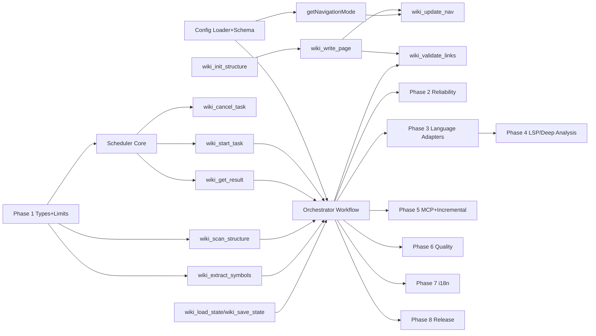

# OpenCode Wiki Generator - Implementation TODO

**Last Updated**: 2026-01-05  
**Based On**: SYSTEM-DESIGN.md v2.1 (`opencode-wiki/docs/SYSTEM-DESIGN.md`)

## Overview

This TODO follows the design's phased roadmap (Phase 1 → Phase 8) with a strict MVP critical path:

- **MVP goal (Phase 1)**: End-to-end "3-phase workflow" (Global Analysis → Concurrent Loop Generation → Final Validation) with a **built-in task scheduler** (no `background_task` dependency), **size-controlled analysis outputs** (Top-N + stats), **incremental resume** via state, and **automatic navigation mode selection** based on `max_concurrent_tasks`.
- **Current repo state**: Tools exist as placeholders in `opencode-wiki/src/index.ts` but **missing** scheduler tools (`wiki_start_task`, `wiki_get_result`, `wiki_cancel_task`), state tools (`wiki_load_state`, `wiki_save_state`), and orchestrator/analyzer implementations. The config schema generator (`opencode-wiki/script/build-schema.ts`) does not match v2.1 config structure.

Conventions used below:
- Effort: **small / medium / large**
- Priority: **high / medium / low**
- Each task includes **Depends on** and **References** (section IDs in SYSTEM-DESIGN.md)

---

## Phase 1: Foundation (MVP) - 2 weeks

### 1.0 Align repo skeleton to v2.1 design
- [ ] (medium, high) Normalize tool APIs to match v2.1 specs (args/return shapes)
  - Depends on: —
  - References: §5.1, §5.3–§5.7
- [ ] (small, high) Define shared TypeScript types for result interfaces (GlobalAnalysisResult, UnitAnalysisResult, GenerationList, NavigationItem)
  - Depends on: tool API normalization
  - References: §4.1–§4.3, §3.3
- [ ] (small, high) Implement "size limits" utilities (Top-N selection + counts + truncation policies)
  - Depends on: shared types
  - References: §1 (Data规模可控), §4.1–§4.2, §6.4 (limits.*), §8.4

### 1.1 Built-in Task Scheduler (critical path)
> Must exist before any "concurrent loop generation" can work.

- [ ] (large, high) Implement internal scheduler core (task registry, queue, worker pool abstraction)
  - Depends on: shared types
  - References: §5.3 (实现说明), §1.设计原则(自包含并发), §8.2
- [ ] (medium, high) Implement concurrency limiting (`max_concurrent_tasks`) + FIFO scheduling
  - Depends on: scheduler core
  - References: §3.2, §5.3
- [ ] (medium, high) Implement task lifecycle states: started/running/completed/failed/cancelled (+ timestamps, duration)
  - Depends on: scheduler core
  - References: §5.3 (wiki_get_result return variants)
- [ ] (medium, high) Implement `wiki_start_task` tool
  - Depends on: scheduler core + lifecycle states
  - References: §5.3 (wiki_start_task)
- [ ] (medium, high) Implement `wiki_get_result` tool (block/non-block, timeout, progress)
  - Depends on: scheduler core + lifecycle states
  - References: §5.3 (wiki_get_result)
- [ ] (medium, medium) Implement `wiki_cancel_task` tool (best-effort cancellation + cleanup)
  - Depends on: scheduler core + lifecycle states
  - References: §5.3 (wiki_cancel_task)
- [ ] (medium, high) Implement scheduler ↔ agent invocation bridge ("call Wiki Analyzer agent")
  - Depends on: scheduler core
  - References: §1 (Analyzer called via scheduler), §3.1–§3.2, §2.2

### 1.2 Analysis tools (MVP extraction; LSP optional later)
- [ ] (medium, high) Implement `wiki_scan_structure` (filesystem traversal with exclude patterns, max_depth, max_files)
  - Depends on: size limits utilities
  - References: §5.4 (wiki_scan_structure), §6.4 (exclude_patterns, limits.max_files_per_analysis)
- [ ] (large, high) Implement `wiki_extract_symbols` fallback extractor (AST-grep/regex-based) with max_symbols
  - Depends on: shared types + size limits utilities
  - References: §5.4 (wiki_extract_symbols), §5.4实现说明(Phase 1-3降级), §6.4 (limits.max_symbols_per_unit)
- [ ] (medium, high) Implement symbol "importance scoring" heuristics (public exports, file location weighting, signature/doc truncation)
  - Depends on: fallback extractor
  - References: §4.2 (importance), §5.4实现说明(重要性排序)

### 1.3 Generation tools (safe writes + navigation strategy)
- [ ] (medium, high) Implement `wiki_init_structure` (create output dir, modules/, `.nojekyll`, validate empty/force)
  - Depends on: config load/validation (Phase 1.5) OR accept args-only initially
  - References: §5.5 (wiki_init_structure), §7.1 (output structure)
- [ ] (medium, high) Implement `wiki_write_page` with atomic write + path traversal guard + auto mkdir
  - Depends on: wiki_init_structure
  - References: §5.5 (wiki_write_page实现说明), §6.4 security (路径遍历防护)
- [ ] (medium, medium) Implement `wiki_update_nav` supporting both modes:
  - Depends on: wiki_write_page
  - References: §3.3 (auto selection), §5.5 (wiki_update_nav), §8.4
- [ ] (small, high) Implement navigation mode selector `getNavigationMode()` (derived, not user-configured)
  - Depends on: config load/validation
  - References: §3.3 (自动选择逻辑), §6.4 navigation_mode

### 1.4 State management (incremental/resume)
- [ ] (medium, high) Implement `wiki_load_state` (read `wiki/.opencode-wiki/state.json`, handle missing)
  - Depends on: wiki_init_structure
  - References: §5.6 (wiki_load_state)
- [ ] (medium, high) Implement `wiki_save_state` (atomic write, update timestamps, config_hash)
  - Depends on: wiki_load_state
  - References: §5.6 (wiki_save_state)
- [ ] (large, high) Implement incremental resume behavior in orchestrator (skip completed items; handle failed items policy)
  - Depends on: orchestrator workflow + state tools
  - References: §1 (可恢复性/增量支持), §5.2 (wiki_load_state usage), §6.4 generation.enable_incremental

### 1.5 Configuration system + schema validation
- [ ] (medium, high) Define runtime config loader (defaulting, path resolution, project-level override)
  - Depends on: shared types
  - References: §6.* (配置系统), §6.4 (defaults)
- [ ] (large, high) Update JSON schema generation to match v2.1 config shape (`agents`, `parallelism`, `generation`, `limits`, `validation`, `security`)
  - Depends on: config loader design
  - References: §2.1/§2.2 (recommended config), §6.4
- [ ] (medium, high) Add config hash computation (stable stringify + sha256) used by state to detect changes
  - Depends on: config loader + state tools
  - References: §5.6 (config_hash), §1 (增量支持)

### 1.6 Orchestrator + Analyzer agent implementations (end-to-end MVP)
> This is the "product" behavior: 3-phase workflow with concurrency.

- [ ] (large, high) Implement Wiki Orchestrator core loop:
  - Depends on: scheduler tools + analysis tools + generation tools + config loader + state tools
  - References: §2.1 (职责), §3.1–§3.2 (流程), §8.1 (三阶段)
- [ ] (medium, high) Implement Phase 1 "Global Analysis → GenerationList" transformation (priorities + dependencies)
  - Depends on: analyzer global output + shared types
  - References: §4.1 (GlobalAnalysisResult), §4.3 (GenerationList), §3.1
- [ ] (large, high) Implement Phase 2 concurrent loop:
  - Depends on: scheduler concurrency + generation list
  - References: §3.2 (dynamic strategy), §2.1 Phase 2 steps
- [ ] (medium, high) Implement Phase 3 final validation hook call
  - Depends on: link validator tool (Phase 1.7) OR stub allowed for MVP
  - References: §2.1 Phase 3, §3.1, §5.2
- [ ] (medium, high) Implement Wiki Analyzer prompts/handlers for:
  - Global analysis mode
  - Unit analysis mode
  - Strict JSON output matching interfaces
  - Depends on: analysis tools + shared types
  - References: Appendix B (Analyzer prompt), §2.2, §4.*

### 1.7 Link validation (MVP correctness)
- [ ] (medium, medium) Implement `wiki_validate_links` (scan `.md`, validate internal relative links, return report)
  - Depends on: wiki_write_page (output exists)
  - References: §5.5 (wiki_validate_links), §5.2 final validation
- [ ] (small, medium) Add "continue_on_failure" behavior (stop vs report-only)
  - Depends on: config loader + wiki_validate_links
  - References: §6.4 validation.continue_on_failure

### 1.8 OpenCode plugin integration (minimum viable UX)
- [ ] (medium, high) Add missing tools to plugin registry: `wiki_start_task`, `wiki_get_result`, `wiki_cancel_task`, `wiki_load_state`, `wiki_save_state`
  - Depends on: tool implementations
  - References: §5.1 (tools list), §2.1 tool permissions
- [ ] (medium, high) Implement `/wiki` slash-command entrypoint that triggers orchestrator run (with config resolution)
  - Depends on: orchestrator core + config loader
  - References: §6.3 (slash_command), §2.1 (Orchestrator role)
- [ ] (small, medium) Ensure analyzer agent is read-only (no write/edit tools) in agent config
  - Depends on: agent wiring
  - References: §2.2 (tools permissions), §8.4 IMPORTANT bullets

### 1.9 Testing & validation (MVP gate)
- [ ] (medium, high) Unit tests: path traversal guard + atomic write + nav modes
  - Depends on: generation tools
  - References: §5.5 (atomic write), §6.4 security
- [ ] (medium, high) Unit tests: scheduler concurrency, timeout, cancel semantics
  - Depends on: scheduler
  - References: §5.3, §3.2
- [ ] (large, high) Integration test fixture repo: run orchestrator end-to-end, verify wiki tree + sidebar + state file
  - Depends on: full Phase 1 pipeline
  - References: §7.1–§7.2, §5.6

---

## Phase 2: Parallelism & Reliability - 1 week

### 2.1 Robust task execution
- [ ] (medium, high) Implement scheduler task timeouts (per-task + default `task_timeout`)
  - Depends on: scheduler core
  - References: §6.4 parallelism.task_timeout, §9 Phase 2
- [ ] (medium, medium) Implement retry policy for failed analyzer tasks (bounded retries, exponential backoff)
  - Depends on: scheduler core + orchestrator loop
  - References: §9 Phase 2
- [ ] (medium, medium) Implement cancellation cascade (cancel parent cancels children)
  - Depends on: wiki_cancel_task + scheduler lifecycle
  - References: §9 Phase 2

### 2.2 Progress, logging, diagnostics
- [ ] (small, medium) Implement progress reporting (task progress in `wiki_get_result` when `block=false`)
  - Depends on: scheduler core
  - References: §5.3 (progress field), §9 Phase 2
- [ ] (medium, medium) Structured logging + debug mode (trace tasks, durations, queue depth)
  - Depends on: scheduler + orchestrator
  - References: §9 Phase 2
- [ ] (medium, low) Performance test harness for large repos (max_files limits, stable runtime)
  - Depends on: scan/symbol extraction + scheduler
  - References: §1 (大型仓库稳定), §6.4 limits.*

---

## Phase 3: Multi-language Support - 3 weeks

### 3.1 Language adapter architecture
- [ ] (medium, high) Define `LanguageAdapter` interface (scan heuristics, symbol extraction, dependency extraction)
  - Depends on: existing analysis tool interfaces
  - References: §9 Phase 3
- [ ] (medium, high) Implement language auto-detection (by file extension distribution + config files)
  - Depends on: scan_structure stats
  - References: §4.1 stats, §9 Phase 3

### 3.2 Adapters
- [ ] (large, high) TypeScript/JavaScript adapter (entrypoints, exports, package.json deps)
  - Depends on: LanguageAdapter + symbol extraction improvements
  - References: §2.2 global/unit responsibilities, §9 Phase 3
- [ ] (large, medium) Python adapter (imports, package metadata, public API heuristics)
  - Depends on: LanguageAdapter
  - References: §9 Phase 3
- [ ] (large, medium) Go adapter (packages, exported identifiers, go.mod deps)
  - Depends on: LanguageAdapter
  - References: §9 Phase 3

### 3.3 Validation
- [ ] (medium, medium) Cross-language integration tests (3 fixture repos)
  - Depends on: adapters
  - References: §9 Phase 3

---

## Phase 4: Deep Code Understanding (LSP + AST) - 4 weeks

### 4.1 LSP integration
- [ ] (large, high) Implement LSP client wrapper and tool facade (hover, document_symbols, diagnostics)
  - Depends on: adapter architecture (Phase 3) OR can be introduced as optional backend
  - References: §9 Phase 4, §5.4实现说明(优先LSP), checklist §C
- [ ] (large, medium) Manage LSP server lifecycle per language (start/stop, workspace root, caching)
  - Depends on: LSP facade
  - References: §9 Phase 4

### 4.2 Improved extraction & analysis
- [ ] (medium, high) Upgrade `wiki_extract_symbols` to prefer LSP (fallback to AST/regex)
  - Depends on: LSP facade
  - References: §5.4实现说明, §9 Phase 4
- [ ] (large, medium) Implement call graph extraction (module-level and symbol-level)
  - Depends on: LSP symbols + dependency parsing
  - References: §9 Phase 4
- [ ] (large, low) Implement design pattern detection heuristics (LSP + AST-grep rules)
  - Depends on: AST-grep integration + call graph
  - References: §9 Phase 4

---

## Phase 5: MCP & Advanced Features - 3 weeks

### 5.1 MCP server
- [ ] (large, medium) Implement `wiki-context-server` MCP (expose repo metadata, cached analysis, wiki state)
  - Depends on: stable state + analysis cache format
  - References: §9 Phase 5

### 5.2 Incremental + external enrichment
- [ ] (large, high) Implement incremental update based on file changes (file_hash comparisons, selective regeneration)
  - Depends on: UnitAnalysisResult.file_hash + state
  - References: §4.2 file_hash, §9 Phase 5
- [ ] (large, medium) Git history analysis integration (recent churn, ownership hints)
  - Depends on: MCP server OR direct git reader
  - References: §9 Phase 5
- [ ] (medium, low) External dependency doc fetching (best-effort; cache; size-limited summaries)
  - Depends on: dependency extraction + size limits utilities
  - References: §9 Phase 5, §1 (数据规模可控)

### 5.3 Consistency checks
- [ ] (large, medium) Document ↔ code consistency checks (detect stale docs, missing modules)
  - Depends on: incremental update + call graph/symbol extraction
  - References: §9 Phase 5

---

## Phase 6: Quality & Stability - 2 weeks

### 6.1 Quality rules + reporting
- [ ] (large, high) Implement rule engine (lint-like checks: missing overview, broken nav structure, missing related links)
  - Depends on: stable outputs + link validation
  - References: §9 Phase 6, checklist §C
- [ ] (medium, medium) Quality report generator (summary + failures + suggested fixes)
  - Depends on: rule engine
  - References: §9 Phase 6

### 6.2 Reliability & UX
- [ ] (medium, medium) Improve error handling (user-friendly messages, actionable remediation)
  - Depends on: orchestrator + tools
  - References: §9 Phase 6
- [ ] (medium, medium) Resource management (memory caps, scan throttling, caching strategy)
  - Depends on: performance measurements
  - References: §1 (大型项目稳定), §9 Phase 6

---

## Phase 7: Internationalization - 3 weeks

### 7.1 Translation architecture
- [ ] (medium, medium) Translation configuration system (target locales, per-section rules, opt-in)
  - Depends on: stable page generation pipeline
  - References: §9 Phase 7
- [ ] (large, medium) Implement "Wiki Translator" subagent with glossary support
  - Depends on: translation config system
  - References: §9 Phase 7
- [ ] (medium, low) Translation quality checks (terminology consistency, link preservation)
  - Depends on: translator + link validator
  - References: §9 Phase 7

### 7.2 Multi-language output structure
- [ ] (medium, low) Implement multi-locale directory layout + nav generation per locale
  - Depends on: wiki_update_nav enhancements
  - References: §9 Phase 7

---

## Phase 8: Release Engineering - 1 week
> Keep this implementation-focused (packaging, CI, versioning). Documentation writing is out-of-scope per requirement.

- [ ] (medium, high) Build/release pipeline (version bump, dist build, schema build, package publish readiness)
  - Depends on: Phase 1 MVP stable
  - References: §9 Phase 8
- [ ] (medium, medium) Add CI checks: typecheck, unit tests, integration fixture run
  - Depends on: test suite
  - References: checklist §C
- [ ] (small, low) Provide example configs + smoke-test script (non-doc heavy)
  - Depends on: config system stable
  - References: §6.4, §9 Phase 8

---

## Dependencies Graph

---

## Next Actions (do these first)

1. Implement shared types + size limit utilities (Phase 1.0).  
2. Implement built-in scheduler + `wiki_start_task`/`wiki_get_result` (Phase 1.1).  
3. Implement `wiki_scan_structure` and minimal `wiki_extract_symbols` fallback (Phase 1.2).  
4. Implement safe writes (`wiki_write_page`) + nav mode auto-selection + state file (Phase 1.3–1.4).  
5. Wire Orchestrator end-to-end 3-phase workflow + basic integration test (Phase 1.6–1.9).
